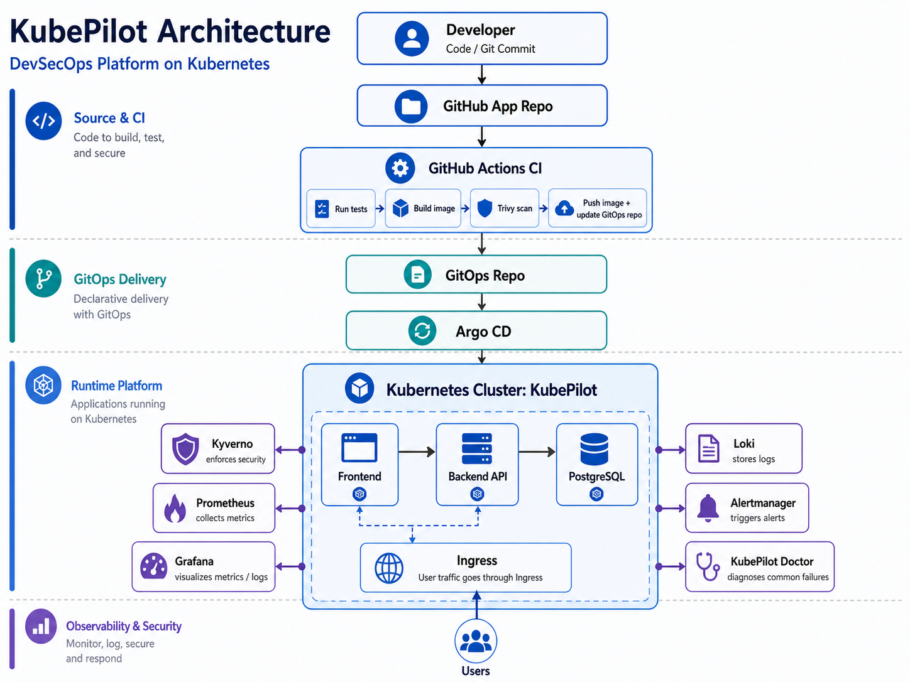

# KubePilot — DevSecOps Platform on Kubernetes



## Why This Project Matters

KubePilot simulates how a real platform team would deliver an application to Kubernetes using modern DevOps practices.

It demonstrates:

- CI/CD automation with GitHub Actions
- GitOps deployment using Argo CD
- Multi-environment promotion using Kustomize
- Container image scanning with Trivy
- Kubernetes policy enforcement with Kyverno
- Metrics, logs, dashboards, and alerts
- Real-world troubleshooting scenarios
- Custom Kubernetes diagnostic tooling


## Overview

**KubePilot** is a production-style DevSecOps and Platform Engineering project built on Kubernetes.

It demonstrates how modern engineering teams can build, deploy, secure, observe, and troubleshoot applications using cloud-native practices.

KubePilot is not just a simple Kubernetes deployment. It is a mini **Internal Developer Platform (IDP)** that combines:

* Docker-based application packaging
* Kubernetes application deployment
* Multi-environment configuration with Kustomize
* GitOps deployment with Argo CD
* CI/CD automation with GitHub Actions
* Container image scanning with Trivy
* Image publishing to GitHub Container Registry
* Policy enforcement with Kyverno
* Metrics with Prometheus
* Dashboards with Grafana
* Logs with Loki and Grafana Alloy
* Alerts with Alertmanager
* Kubernetes troubleshooting with a custom CLI called KubePilot Doctor
* Hands-on break/fix troubleshooting labs

The goal of this project is to show how a real platform team can create a safe, observable, and automated path from code commit to Kubernetes deployment.

---

## Project Goal

The main question KubePilot answers is:

> How can developers deploy applications safely to Kubernetes using GitOps, CI/CD, security policies, observability, and automated troubleshooting?

Instead of manually applying YAML files or debugging issues blindly, KubePilot provides a complete cloud-native delivery workflow:

```text
Developer Pushes Code
        ↓
GitHub Actions CI/CD
        ↓
Build + Trivy Scan + Push Images
        ↓
Update Kustomize Image Tags
        ↓
Argo CD GitOps Sync
        ↓
Kubernetes Deployment
        ↓
Kyverno Security Policies
        ↓
Prometheus + Grafana + Loki Observability
        ↓
KubePilot Doctor Troubleshooting
```

---

## Architecture

KubePilot follows a layered architecture:

```text
[Developer]
    │
    ▼
[GitHub App Repo]
    │
    ▼
[GitHub Actions CI]
    │
    ├── Run tests
    ├── Build image
    ├── Trivy scan
    └── Push image + update GitOps repo
                     │
                     ▼
              [GitOps Repo]
                     │
                     ▼
                 [Argo CD]
                     │
                     ▼
         [Kubernetes Cluster: KubePilot]
                     │
   ┌─────────────────┼─────────────────────┐
   │                 │                     │
   ▼                 ▼                     ▼
[Frontend]       [Backend API]        [PostgreSQL]
   │                 │
   └─────── user traffic via Ingress / Service ──────┘

Side Systems:
- Kyverno enforces security
- Prometheus collects metrics
- Grafana visualizes metrics and logs
- Loki stores logs
- Grafana Alloy collects pod logs
- Alertmanager triggers alerts
- KubePilot Doctor diagnoses common failures
```

Full architecture document:

```text
docs/architecture.md
```

---

## Tech Stack

| Area                     | Technology                                |
| ------------------------ | ----------------------------------------- |
| Frontend                 | HTML, CSS, JavaScript, Nginx Unprivileged |
| Backend                  | Python Flask                              |
| Database                 | PostgreSQL                                |
| Containerization         | Docker, Docker Compose                    |
| Orchestration            | Kubernetes                                |
| Local Cluster            | kind                                      |
| Configuration Management | Kustomize                                 |
| GitOps                   | Argo CD                                   |
| CI/CD                    | GitHub Actions                            |
| Image Registry           | GitHub Container Registry                 |
| Security Scanning        | Trivy                                     |
| Policy Enforcement       | Kyverno                                   |
| Metrics                  | Prometheus                                |
| Dashboards               | Grafana                                   |
| Logs                     | Loki                                      |
| Log Collection           | Grafana Alloy                             |
| Alerting                 | Alertmanager                              |
| Troubleshooting          | KubePilot Doctor Python CLI               |

---
## Project Screenshots

### KubePilot Application Running


### GitHub Actions CI/CD Pipeline


### GHCR Container Images


### Argo CD Applications


### Dev Environment Synced in Argo CD


### Staging Environment Healthy


### Production Environment Healthy


### Grafana Observability Dashboard


### Loki Logs


### Kyverno Policies


### KubePilot Doctor CLI


## Key Features

### 1. Local Development with Docker Compose

KubePilot can run locally using Docker Compose.

Services:

* Frontend
* Backend API
* PostgreSQL

```bash
docker compose up --build
```

Local URLs:

```text
Frontend: http://localhost:8081
Backend:  http://localhost:5000
```

---

### 2. Kubernetes Deployment

KubePilot includes Kubernetes manifests for:

* Namespace
* ConfigMap
* Secret
* PostgreSQL PVC
* PostgreSQL Deployment and Service
* Backend Deployment and Service
* Frontend Deployment and Service
* Startup probes
* Readiness probes
* Liveness probes
* Resource requests and limits
* Non-root frontend container

Deploy base manifests:

```bash
kubectl apply -k k8s/base
```

---

### 3. Multi-Environment Kustomize Overlays

KubePilot supports three environments:

| Environment | Namespace           | Purpose                                   |
| ----------- | ------------------- | ----------------------------------------- |
| Dev         | `kubepilot-dev`     | Fast development and automatic deployment |
| Staging     | `kubepilot-staging` | Pre-production validation                 |
| Prod        | `kubepilot-prod`    | Production-style environment              |

Deploy environments:

```bash
kubectl apply -k k8s/overlays/dev
kubectl apply -k k8s/overlays/staging
kubectl apply -k k8s/overlays/prod
```

---

### 4. GitOps with Argo CD

Argo CD continuously watches the Git repository and syncs Kubernetes state from Git.

Applications:

| Argo CD App         | Path                   | Namespace           |
| ------------------- | ---------------------- | ------------------- |
| `kubepilot-dev`     | `k8s/overlays/dev`     | `kubepilot-dev`     |
| `kubepilot-staging` | `k8s/overlays/staging` | `kubepilot-staging` |
| `kubepilot-prod`    | `k8s/overlays/prod`    | `kubepilot-prod`    |

Apply Argo CD applications:

```bash
kubectl apply -f gitops/argocd-apps/
```

Access Argo CD:

```bash
kubectl port-forward svc/argocd-server -n argocd 8080:443
```

Open:

```text
https://localhost:8080
```

---

### 5. CI/CD with GitHub Actions, Trivy, and GHCR

The GitHub Actions workflow automates the Dev environment deployment.

Pipeline flow:

```text
Code Push
   ↓
GitHub Actions
   ↓
Build Backend Image
   ↓
Build Frontend Image
   ↓
Scan Images with Trivy
   ↓
Push Images to GHCR
   ↓
Update Dev Kustomize Image Tags
   ↓
Argo CD Syncs Dev Environment
```

Workflow file:

```text
.github/workflows/ci-cd-dev.yml
```

---

### 6. Security with Kyverno

Kyverno is used as the Kubernetes admission control layer.

Policies implemented:

| Policy                         | Mode    | Purpose                                    |
| ------------------------------ | ------- | ------------------------------------------ |
| Disallow privileged containers | Enforce | Blocks privileged containers               |
| Disallow latest image tag      | Enforce | Blocks mutable image tags                  |
| Require requests and limits    | Enforce | Requires CPU/memory requests and limits    |
| Require non-root containers    | Audit   | Reports containers not running as non-root |
| Require health probes          | Audit   | Reports missing readiness/liveness probes  |

Apply policies:

```bash
kubectl apply -f platform/kyverno/policies/
```

Test bad manifests:

```bash
kubectl apply -f platform/kyverno/test-manifests/bad-privileged-pod.yaml
kubectl apply -f platform/kyverno/test-manifests/bad-latest-no-resources.yaml
```

Security documentation:

```text
docs/security-kyverno.md
```

---

### 7. Observability with Prometheus, Grafana, Loki, Alloy, and Alertmanager

KubePilot includes a complete observability stack.

| Component     | Purpose                            |
| ------------- | ---------------------------------- |
| Prometheus    | Metrics collection                 |
| Grafana       | Dashboards and visualization       |
| Loki          | Log storage                        |
| Grafana Alloy | Kubernetes log collection          |
| Alertmanager  | Alert routing and alert visibility |

The backend exposes custom Prometheus metrics at:

```text
/metrics
```

Example metrics:

```text
kubepilot_http_requests_total
kubepilot_http_request_duration_seconds
kubepilot_tasks_total
kubepilot_database_ready
```

Access Grafana:

```bash
kubectl port-forward svc/monitoring-grafana 3000:80 -n monitoring
```

Open:

```text
http://localhost:3000
```

Access Prometheus:

```bash
kubectl port-forward svc/monitoring-kube-prometheus-prometheus 9090:9090 -n monitoring
```

Access Alertmanager:

```bash
kubectl port-forward svc/alertmanager-operated 9093:9093 -n monitoring
```

Observability documentation:

```text
docs/observability.md
```

---

### 8. KubePilot Doctor — Troubleshooting CLI

KubePilot Doctor is a custom Python CLI that diagnoses common Kubernetes issues.

It checks:

* Namespace existence
* Pod health
* Container waiting states
* ImagePullBackOff
* CrashLoopBackOff
* OOMKilled
* Deployment replica health
* Services with no endpoints
* Recent warning events
* Argo CD sync and health status

Run Doctor:

```bash
python tools/kubepilot-doctor/doctor.py check namespace kubepilot-dev
```

Check namespace and Argo CD app:

```bash
python tools/kubepilot-doctor/doctor.py check namespace kubepilot-dev --argocd-app kubepilot-dev
```

Check Argo CD applications:

```bash
python tools/kubepilot-doctor/doctor.py check argocd
```

Example output:

```text
KubePilot Doctor Diagnosis
==========================
Namespace: kubepilot-dev

Pod Health
==========
✅ Pod kubepilot-backend-xxxxx is Running and Ready.
✅ Pod kubepilot-frontend-xxxxx is Running and Ready.
✅ Pod kubepilot-postgres-xxxxx is Running and Ready.

Service and Endpoint Health
===========================
✅ Service kubepilot-backend has 1 endpoint(s).
✅ Service kubepilot-frontend has 1 endpoint(s).
✅ Service kubepilot-postgres has 1 endpoint(s).
```

Doctor documentation:

```text
docs/kubepilot-doctor.md
```

---

## Troubleshooting Labs

KubePilot includes hands-on Kubernetes troubleshooting labs.

| Lab | Scenario                  | Main Concept                                 |
| --- | ------------------------- | -------------------------------------------- |
| 01  | Service selector mismatch | Services select Pods using labels            |
| 02  | Wrong targetPort          | Service targetPort must match container port |
| 03  | Readiness probe failing   | Running Pods may not be Ready                |
| 04  | ImagePullBackOff          | Image name, tag, registry, or pull issue     |
| 05  | CrashLoopBackOff          | App starts and crashes repeatedly            |
| 06  | OOMKilled                 | Container exceeds memory limit               |
| 07  | Argo CD OutOfSync         | GitOps drift detection                       |
| 08  | NetworkPolicy blocking    | Traffic blocked despite healthy endpoints    |

Run a lab:

```bash
kubectl apply -f troubleshooting-labs/01-service-selector-mismatch/broken-service.yaml
python tools/kubepilot-doctor/doctor.py check namespace kubepilot-dev
kubectl delete -f troubleshooting-labs/01-service-selector-mismatch/broken-service.yaml
```

Troubleshooting labs documentation:

```text
docs/troubleshooting-labs.md
```

---

## Repository Structure

```text
kubepilot-platform/
├── .github/
│   └── workflows/
│       └── ci-cd-dev.yml
├── apps/
│   ├── backend/
│   └── frontend/
├── docs/
│   ├── architecture.md
│   ├── gitops-argocd.md
│   ├── kubepilot-doctor.md
│   ├── observability.md
│   ├── security-kyverno.md
│   ├── troubleshooting-labs.md
│   └── images/
├── gitops/
│   └── argocd-apps/
├── k8s/
│   ├── base/
│   └── overlays/
│       ├── dev/
│       ├── staging/
│       └── prod/
├── platform/
│   ├── alerting/
│   ├── argocd/
│   ├── kyverno/
│   ├── logging/
│   └── monitoring/
├── tools/
│   └── kubepilot-doctor/
├── troubleshooting-labs/
│   ├── 01-service-selector-mismatch/
│   ├── 02-wrong-targetport/
│   ├── 03-readiness-probe-failing/
│   ├── 04-imagepullbackoff/
│   ├── 05-crashloopbackoff/
│   ├── 06-oomkilled/
│   ├── 07-argocd-outofsync/
│   └── 08-networkpolicy-blocking/
├── docker-compose.yml
└── README.md
```

---

## Quick Start

### Prerequisites

Install:

* Docker
* Docker Compose
* kubectl
* kind
* Helm
* Git
* Python 3

---

### 1. Clone the Repository

```bash
git clone https://github.com/<your-username>/kubepilot-platform.git
cd kubepilot-platform
```

---

### 2. Run Locally with Docker Compose

```bash
docker compose up --build
```

Open:

```text
http://localhost:8081
```

---

### 3. Create a kind Cluster

```bash
kind create cluster --name my-cluster
```

Build and load local images:

```bash
docker build -t kubepilot-backend:v1 ./apps/backend
docker build -t kubepilot-frontend:v1 ./apps/frontend
kind load docker-image kubepilot-backend:v1 --name my-cluster
kind load docker-image kubepilot-frontend:v1 --name my-cluster
```

---

### 4. Deploy Kubernetes Base

```bash
kubectl apply -k k8s/base
```

Check:

```bash
kubectl get pods -n kubepilot
```

Access app:

```bash
kubectl port-forward svc/kubepilot-frontend 8082:80 -n kubepilot
```

Open:

```text
http://localhost:8082
```

---

### 5. Deploy Dev, Staging, and Prod

```bash
kubectl apply -k k8s/overlays/dev
kubectl apply -k k8s/overlays/staging
kubectl apply -k k8s/overlays/prod
```

Access environments:

```bash
kubectl port-forward svc/kubepilot-frontend 8084:80 -n kubepilot-dev
kubectl port-forward svc/kubepilot-frontend 8085:80 -n kubepilot-staging
kubectl port-forward svc/kubepilot-frontend 8086:80 -n kubepilot-prod
```

URLs:

```text
Dev:     http://localhost:8084
Staging: http://localhost:8085
Prod:    http://localhost:8086
```

---

## Demo Flow

A recommended demo flow for interviews, LinkedIn, or YouTube:

1. Show the architecture diagram.
2. Show the app running locally.
3. Show Kubernetes dev/staging/prod environments.
4. Show Argo CD apps synced and healthy.
5. Push a code change to GitHub.
6. Show GitHub Actions building and scanning images.
7. Show GHCR images.
8. Show Argo CD automatically syncing the dev environment.
9. Show Kyverno blocking an unsafe manifest.
10. Show Grafana dashboards and Loki logs.
11. Break a Kubernetes Service.
12. Run KubePilot Doctor.
13. Fix the issue.

---

## Skills Demonstrated

This project demonstrates practical experience in:

* Kubernetes workloads and networking
* Kubernetes probes and resource management
* Docker and Docker Compose
* GitOps with Argo CD
* CI/CD with GitHub Actions
* Container registry workflows with GHCR
* Image vulnerability scanning with Trivy
* Policy enforcement with Kyverno
* Kustomize base and overlays
* Multi-environment deployment patterns
* Prometheus metrics and ServiceMonitor
* Grafana dashboards
* Loki-based logging
* Grafana Alloy log collection
* Alertmanager alerting
* Kubernetes troubleshooting
* Custom platform tooling with Python
* DevSecOps and Platform Engineering practices

---

## Resume Summary

```text
Built KubePilot, a Kubernetes-based Internal Developer Platform implementing GitOps delivery with Argo CD, multi-environment Kustomize overlays, GitHub Actions CI/CD, Trivy image scanning, Kyverno policy enforcement, Prometheus/Grafana observability, Loki logging, Alertmanager alerts, and a custom Python troubleshooting CLI.
```

---

## Interview Explanation

KubePilot is a practical DevSecOps platform that shows how an application can move from code commit to secure Kubernetes deployment.

The project starts with a simple frontend, backend, and PostgreSQL application. The application is containerized with Docker, deployed to Kubernetes, and managed across dev, staging, and prod using Kustomize overlays.

Argo CD provides GitOps deployment and continuously syncs the desired state from Git. GitHub Actions builds and scans container images using Trivy, pushes them to GHCR, and updates the dev image tags. Kyverno enforces security policies at admission time. Prometheus, Grafana, Loki, Alloy, and Alertmanager provide observability. KubePilot Doctor helps diagnose Kubernetes failures such as ImagePullBackOff, CrashLoopBackOff, OOMKilled, readiness probe failures, service endpoint issues, and Argo CD drift.

This project demonstrates end-to-end Platform Engineering, DevOps, DevSecOps, GitOps, Observability, and Kubernetes troubleshooting skills.

---

## Future Improvements

Planned improvements:

* Add NGINX Ingress Controller and local domain support
* Package the application as a Helm chart
* Add Horizontal Pod Autoscaler
* Add PodDisruptionBudget
* Add ResourceQuota and LimitRange
* Add stronger NetworkPolicies
* Add private GHCR image pull using imagePullSecrets
* Add External Secrets or Sealed Secrets
* Add Grafana dashboard JSON files
* Add automated tests for KubePilot Doctor
* Add GitHub Actions pipeline for staging and production promotion

---

## Project Status

Current status:

```text
Core platform complete.
Portfolio polish and advanced production hardening in progress.
```

Completed:

* Application
* Docker Compose
* Kubernetes base deployment
* Kustomize overlays
* Argo CD GitOps
* GitHub Actions CI/CD
* Trivy scanning
* GHCR image publishing
* Kyverno policies
* Observability stack
* KubePilot Doctor
* Troubleshooting labs

---

## Author

Created by **Ghanathey Neelesh Kumar**

LinkedIn: `https://www.linkedin.com/in/neeleshghanathey/`
GitHub: `https://github.com/Ghanathey-Neelesh-Kumar`
YouTube: `https://www.youtube.com/@ghanatheyneelesh`

---

